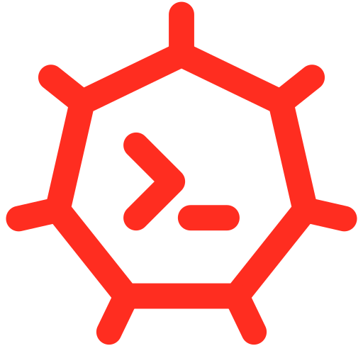

<p align="center">
  
</p>

# 🚀 LaraKube CLI
> The professional Kubernetes orchestrator for Laravel.

[](https://larakube.luchtech.dev)
[](https://github.com/luchavez-technologies/larakube-cli/releases)
[](https://opensource.org/licenses/MIT)

LaraKube is a high-performance Kubernetes orchestrator for Laravel, distributed as a **zero-dependency standalone binary** for Linux and macOS.

## 🌟 Key Features
- **📦 Standalone Binary**: No local PHP, Node.js, or Composer required.
- **🤖 AI-Native Interaction**: Built-in **LaraKube Chat** for orchestration via natural language.
- **🔌 Dynamic MCP Server**: Auto-scaffolding for **Gemini**, **Claude**, and **Cursor** to manage your cluster.
- **🏗 Masterpiece Blueprints**: One-command architecture for complex, real-time Laravel stacks.
- **🔒 Stability-First**: Hardened **Serversideup** configurations and automated local HTTPS (`larakube trust`).

## 📥 Quick Install (Mac/Linux)

```bash
curl -sSL https://larakube.luchtech.dev/install.sh | bash
```

## 🛠 AI-Native Usage

### 💬 LaraKube Chat
Interact with your cluster using natural language:
```bash
larakube chat
# Or single-shot:
larakube chat --query="Create a project named shop with MariaDB and Redis"
```

### 🧠 Intelligent Doctor
Automatically diagnose and heal cluster issues:
```bash
larakube doctor --ai
```

### 🔌 Global MCP Registration
Enable AI agents to manage any project directory:
```bash
larakube config:mcp --all
```

## 🏗 Common Commands
- `larakube new`: Scaffold a new architectural masterpiece.
- `larakube up`: Deploy infrastructure to your local cluster.
- `larakube stop`: Scale down pods to save resources without deleting data.
- `larakube trust`: Install Local CA for seamless HTTPS.

## 📖 Documentation
For high-context guides, recipes, and architectural deep-dives, visit the official documentation:
👉 **[https://larakube.luchtech.dev](https://larakube.luchtech.dev)**

## 📄 License
LaraKube is open-source software licensed under the MIT license.
